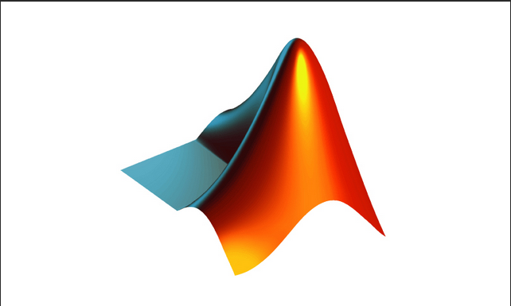

# Matlab
> MATLAB2018b

---

# 目录
* [1.MATLAB用户界面](#1.MATLAB用户界面)
* [2.帮助系统](#2.帮助系统)
* [3.MATLAB基础知识](#3.MATLAB基础知识)
* [4.向量与多项式子](#4.向量与多项式子)
* [5.矩阵运算](#5.矩阵运算)
* [6.二维绘图](#6.二维绘图)

---

# 1.MATLAB用户界面

## 1.1 MATLAB中的科学计算概述

> MATLAB是一款功能非常强大的科学计算软件。

# 2.帮助系统

# 3.MATLAB基础知识

## 3.1 MATLAB命令的组成

### 3.1.1 基本符号

### 3.1.2 功能符号

### 3.1.3 常用指令

| 命令    | 功能                   | 命令   | 功能               |
| ------- | ---------------------- | ------ | ------------------ |
| `clf`   | 清除图形窗口信息       | `hold` | 图形保持           |
| `diary` | 日志文件               | `load` | 加载指定文件的变量 |
| `dir`   | 显示当前目录下文件     | `pack` | 显示搜索目录       |
| `disp`  | 显示变量或文字内容     | `quit` | 退出MATLAB         |
| `echo`  | 命令行窗口信息显示开关 | `path` | 显示搜索目录       |
| `save`  | 保存内存变量指定文件   | `type` | 显示文件内容       |

## 3.2 数据类型

### 3.2.1 变量与常量

* 变量
* 常量

| 常量名称 | 说明               |
| -------- | ------------------ |
| `ans`    | MATLAB中的默认变量 |
|          |                    |
|          |                    |

# 4. 向量与多项式子

# 5.矩阵运算

# 6. 二维绘图

# 7.图形标注

# 8.三维绘图

# 9. 程序设计

